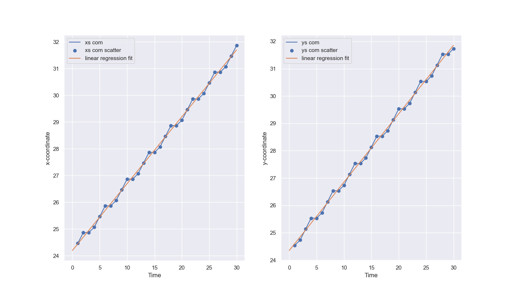

# Game of Life - Coursework 2 Part 1 (2021 - 2022)

### **Course Name**: Modelling and Visualisation in Physics
### **Coursework Name**: Game of Life
### **Objectives**:
* **Simulate** the game of life on a 50 × 50 2d square lattice with periodic boundary conditions and show a visualisation of the system as it is running.
* Include different types of states: One developing into an oscillator, a state developing into a glider (both of these leading to **oscillatory steady states**), and another one leading to an **absorbing state** (i.e., that does not change with time)
* Obtain a **histogram** with the time needed to reach an equilibrium for simulations starting with a random initial condition.
* Obtain a plot of the centre of mass versus time when the initial condition is a glider, together with appropriate linear fits to obtain the **velocity** of the glider.
### **Programming Language**:  Python3
### **Final Mark**: 15 / 15


## Files

  * **[CellularAutomataDocument.pdf](src/CellularAutomataDocument.pdf)** --> This pdf file contains the description of Game of Life.
  * **[src](src)** --> This directory contains the code for the project, and a Jupyter notebook, test.ipynb, in which I plotted the histogram with the equilibration time, and where I developed a faster way to update the Game of Life system.
  * **[GameOfLifeData.csv](GameOfLifeData.csv)** --> csv file containing the equilibration times of the 1000 different simulations run. There are less than 1000 entries because when the simulation takes more than 3000 time steps to complete I do not record its equilibration time.


## Brief description of the Game of Life

The Game of Life is a famous cellular automaton, which was introduced by Conway in the 70’s. It is defined on a square lattice, and its state is determined by the states of all cells in the lattice. Each of the cell can be either “dead”, or “alive”. The evolution of the Game of Life on a lattice is fully deterministic and is set by the following, very simple, rules: 
* Any live cell with less than 2 live neighbours dies.
* Any live cell with 2 or 3 live neighbours lives on to the next step. 
* Any live cell with more than 3 live neighbours dies. 
* Any dead cell with exactly 3 live neighbours becomes alive. 

In the Game of Life it is conventional to consider as neighbours all cells which have at least a point in contact with a given cell; i.e. there are 8 neighbours for each cell (north, south, east, west, and the four neighbours along the lattice diagonals). The dynamics in the Game of Life is called fully parallel and deterministic. The meaning of deterministic here is simple: there is no stochasticity in the rules of the Game of Life. As for parallel, this means that all cells are evolved to the n+1-th time steps simultaneously, based on the knowledge of the system state at the n−th time step. In other words, in a parallel update we loop through the lattice, set the system state to a temporary variable, then update the new state to be this temporary variable. 

There are three different behaviours observed: 
1. The system may evolve into a state into which the dynamics gets stuck (a non-thermal-equilibrium statistical physics model, or **absorbing state**). In such a state the dynamics is not ergodic: if we were to start from the absorbing state no other state can be reached by the dynamical update rules. 

1. A second possibility is that the system evolves into a **perpetually oscillating steady state**. An example is the “blinker” (see Fig. 1(C) in CellularAutomataDocument.pdf). It is made up by a column of three neighbouring live cells. 

1. Finally, an interesting state is the “glider”. This more complicated pattern moves with *constant velocity*. A repeated application of the update rules shows that the glider here moves to the right and down, with configurations which cyclically repeat themselves. Within the Game of Life, self-motile patterns are called “spaceships”.

For more information, check out the CellularAutomataDocument.pdf and try the experiments in **src/experiments.py**

## Getting Started

These subsections will help you get a copy of the project and understand how to run it on your local machine for development and testing purposes.
I will discuss how to clone this repository and set it up in any IDE of your choice. Furthermore, instructions on how to run the server will be given as well as how to run the project from the terminal.

### How to Install

The first thing you should do is clone this repository into your local machine. You can do this with the following command:
```
git clone https://github.com/Paramiru/Game-Of-Life
```
Once you have cloned the repository, you should check your current version of Python. I used Python3 for the project. You can check the version you are currently using running this command in the terminal.
```
python --version
```
In order to run the project with the same version I am using you can import the conda environment with the environment.yml file provided by running in your terminal:
```
conda env create -f environment.yml
```
This will create an environment named *GameOfLife* which you can use for running the code without having to install the dependencies on your system. Read [this article](https://realpython.com/python-virtual-environments-a-primer/) to understand the reasons for why virtual environments are important in Python.

## Running the Project 

Once you have cloned the repository and have the conda environment (or another virtual environment with the required dependencies) you can then run the **experiments.py** file which will plot the animation of the game of life by default (this corresponds to the method `exp2()`). If you want to obtain the plot and fits for the glider, change the code in **experiments.py** and run the method `exp3()`. Note: `exp1()` was used to obtain the GameOfLifeData.csv file with which the histogram is plotted. You can run it again to see how much the equilibration time varies, but it will be centered around 500 time steps.

## Results obtained from the Game of Life simulations
To reproduce these results you can run the different experiments set in **experiments.py**.

All these measurements were taken for a 50 x 50 square lattice.

### Equilibration times
In order to obtain the equilibration time of a given system the simulation was stopped when the number of alive cells did not change after 10 different time steps. This is because we might have permanent oscillatory systems which migth seem to be changing, while in reality they are stuck in the same oscillation.

<br>
<p align="center">
  
  <br>
</p>

<hr>

### Centre of Mass data
By running `exp3()` in **experiments.py** we obtain the centre of mass data w.r.t. time, when our initial condition is a "glider". By fitting such data we obtain the velocity. The results I obtained were:

* Least squares fitting for x-coord data:
 [[ 0.2501891]
 [24.1954023]],
  where 24.2 corresponds to the y-intercept and 0.25 is the gradient. Thus, $v_x = 0.24$ as $v_x := \frac{d{x}}{d{t}}$

* Least squares fitting for y-coord data:
 [[ 0.25014461]
 [24.34942529]]. Similarly as with the x-coord data, we find that $v_y \approx 0.24$

<p align="center">
  
  <br>
</p>

<hr>

## Built With

* [Python3](https://www.python.org/downloads/)
* [Conda](https://docs.conda.io/en/latest/) - Dependency Management for Python

## Python Dependencies

* [Numpy](https://numpy.org/doc/stable/index.html)
* [Matplotlib](https://matplotlib.org/stable/)

## Authors

* **Pablo Miró** - [Paramiru](https://github.com/Paramiru)

